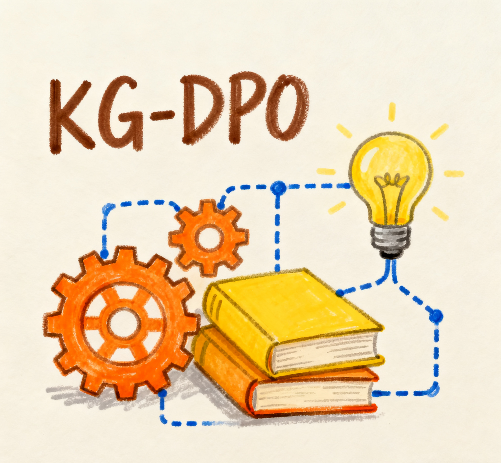

<p align="center">
  
</p>

<!-- icon -->

<!-- [](https://github.com/open-sciencelab/KG-DPO)
[](https://github.com/open-sciencelab/KG-DPO)
[](https://github.com/open-sciencelab/KG-DPO/issues)
[](https://github.com/open-sciencelab/KG-DPO/issues)
[](https://kg-dpo-cookbook.readthedocs.io/en/latest/)
[](https://cdn.vansin.top/internlm/dou.jpg)
[](https://arxiv.org/abs/2505.20416)
[](https://huggingface.co/papers/2505.20416) -->

KG-DPO: Knowledge-Graph Enhanced Direct Preference Optimization Data Synthesis Framework

<details open>
<summary><b>📚 Table of Contents</b></summary>

- 📝 [What is KG-DPO?](#-what-is-kg-dpo)
- 🚀 [Quick Start](#-quick-start)
- 📌 [Latest Updates](#-latest-updates)
- 🏗️ [Methods & Results](#-methods--results)
- 🍀 [Acknowledgements](#-acknowledgements)
- 📚 [Citation](#-citation)
- 📜 [License](#-license)

</details>

## 📝 What is KG-DPO?

In this work, we propose and validate a novel knowledge-graph-based DPO data synthesis method, termed KG-DPO, which leverages Negative Example Mining (NE-Mining) to construct high-quality DPO training datasets. The framework integrates the strengths of knowledge graphs—structured, relational knowledge—with the advantages of Direct Preference Optimization (DPO) in preference learning. Specifically, it first exploits knowledge graphs to generate question–answer pairs enriched with deep logical structures and entity relations. Then, through negative example mining, it creates factually conflicting but stylistically consistent counterexamples, forming preference data pairs for DPO training. We conduct systematic experiments on the knowledge-intensive benchmarks HotpotQA and PQAref.This study provides a validated and effective paradigm for applying LLMs to knowledge-intensive domains.

## 🚀 Quick Start

### Environment Setup

```bash
# Create conda environment
conda create -n kg_dpo python=3.10
conda activate kg_dpo

# Install dependencies
pip install -r requirements.txt
```

### Data Generation

```bash
# Generate KG-DPO data
bash scipt/run-kg-dpo.sh
```

### Data Format Conversion

```bash
# Convert to ChatML format
bash scipt/chatml-convert.sh
```

### Knowledge Graph Visualization

```bash
# Visualize knowledge graphs
bash scipt/kg-visual.sh
```

### Evaluation

```bash
# Run evaluation on benchmarks
bash scipt/run-eval.sh
```

### Training

```bash
# DPO training example
bash scipt/example-train-dpo.sh

# SFT training example  
bash scipt/example-train-sft.sh

# CPT training example
bash scipt/example-train-cpt.sh
```

## 📌 Latest Updates

- **2025.09.18**: Initial release of KG-DPO framework

## 🏗️ Methods & Results

### Key Methodological Innovations
<p align="center">
  
</p>

1. **KG-DPO Framework**: First systematic integration of knowledge graph-driven data synthesis with negative example mining (NE-mined) based DPO training. This framework leverages knowledge graphs to generate high-quality training data rich in deep logical reasoning and entity relationships, and constructs preference pairs (positive vs. negative examples) for DPO training.

2. **Empirical Validation**: Conducted extensive experiments on a series of knowledge-intensive tasks, validating the effectiveness of KG-DPO. Results show that the framework significantly outperforms multiple baseline models including continued pretraining, corpus-based SFT (Corpus-SFT), knowledge graph-based SFT (KG-SFT), and corpus-based DPO (Corpus-DPO).

3. **Mechanism Analysis**: Beyond validating overall effectiveness, conducted in-depth analysis of the underlying mechanisms. Research shows that compared to corpus-based synthesis methods, knowledge graph-based synthetic data has higher knowledge density and stronger logical consistency; meanwhile, DPO training using negative examples can effectively reduce the risk of learning spurious patterns, ultimately overcoming the limitations of SFT.

### Experimental Results
#### Method Comparison
<p align="center">
  
</p>

#### Experimental Results
<table><thead><tr><th rowspan="2"><p>Model Type</p></th><th rowspan="2"><p>Method Group</p></th><th rowspan="2"><p>Method Name</p></th><th colspan="2"><p>HotpotEvel</p></th><th colspan="2"><p>PQArefEvel</p></th></tr><tr><th><p>Acc</p></th><th><p>Std</p></th><th><p>Acc</p></th><th><p>Std</p></th></tr></thead><tbody><tr><td rowspan="5"><p>Qwen2.5-1.5B-Base</p></td><td rowspan="3"><p>Non-DPO</p></td><td><p>GraphGen (KG-SFT)</p></td><td><p>0.1324</p></td><td><p>0.0029</p></td><td><p>0.1468</p></td><td><p>0.0029</p></td></tr><tr><td><p>Entigraph (KG-SFT)</p></td><td><p>0.1452</p></td><td><p>0.0050</p></td><td><p>0.1515</p></td><td><p>0.0081</p></td></tr><tr><td><p>Corpus-QAGen (Corpus-SFT)</p></td><td><p>0.1410</p></td><td><p>0.0038</p></td><td><p>0.1345</p></td><td><p>0.0032</p></td></tr><tr><td rowspan="2"><p>DPO-Enhanced</p></td><td><p>Corpus-QAGen (Corpus-DPO)</p></td><td><p>0.2075</p></td><td><p>0.0021</p></td><td><p>0.2388</p></td><td><p>0.0039</p></td></tr><tr><td><p>GraphGen (KG-DPO)</p></td><td><p><strong>0.2180</strong></p></td><td><p><strong>0.0020</strong></p></td><td><p><strong>0.2597</strong></p></td><td><p><strong>0.0027</strong></p></td></tr><tr><td rowspan="5"><p>Qwen2.5-1.5B-Instruct</p></td><td rowspan="3"><p>Non-DPO</p></td><td><p>GraphGen (KG-SFT)</p></td><td><p>0.1721</p></td><td><p>0.0026</p></td><td><p>0.1630</p></td><td><p>0.0047</p></td></tr><tr><td><p>Entigraph (KG-SFT)</p></td><td><p>0.1703</p></td><td><p>0.0026</p></td><td><p>0.1572</p></td><td><p>0.0034</p></td></tr><tr><td><p>Corpus-QAGen (Corpus-SFT)</p></td><td><p>0.1603</p></td><td><p>0.0038</p></td><td><p>0.1649</p></td><td><p>0.0029</p></td></tr><tr><td rowspan="2"><p>DPO-Enhanced</p></td><td><p>Corpus-QAGen (Corpus-DPO)</p></td><td><p>0.2292</p></td><td><p>0.0022</p></td><td><p>0.4155</p></td><td><p>0.0024</p></td></tr><tr><td><p>GraphGen (KG-DPO)</p></td><td><p><strong>0.2383</strong></p></td><td><p><strong>0.0015</strong></p></td><td><p><strong>0.4573</strong></p></td><td><p><strong>0.0019</strong></p></td></tr></tbody></table>

## 🍀 Acknowledgements

This project builds upon and extends several excellent open-source frameworks:

- **[GraphGen](https://github.com/open-sciencelab/GraphGen)**: Knowledge-graph guided synthetic data generation framework
- **[Swift](https://github.com/modelscope/swift)**: Efficient model training and inference framework
- **[SiliconFlow](https://siliconflow.cn)**: Abundant LLM API, some models are free
- **[LightRAG](https://github.com/HKUDS/LightRAG)**: Simple and efficient graph retrieval solution
- **[ROGRAG](https://github.com/tpoisonooo/ROGRAG)**: A robustly optimized GraphRAG framework
- **[DB-GPT](https://github.com/eosphoros-ai/DB-GPT)**: An AI native data app development framework

We sincerely thank these projects and their contributors for their foundational work.

## 📚 Citation

If you use KG-DPO in your research, please cite our work:

<!-- ```bibtex
@misc{chen2025kgdpoenhancingllmswithknowledgegraphs,
      title={KG-DPO: Enhancing LLMs with Knowledge Graphs and Direct Preference Optimization}, 
      author={Zihong Chen and Wanli Jiang and Jinzhe Li and Zhonghang Yuan and Huanjun Kong and Wanli Ouyang and Nanqing Dong},
      year={2025},
      eprint={2505.20416},
      archivePrefix={arXiv},
      primaryClass={cs.CL},
      url={https://arxiv.org/abs/2505.20416}, 
}
``` -->

## 📜 License

This project is licensed under the [Apache License 2.0](LICENSE).