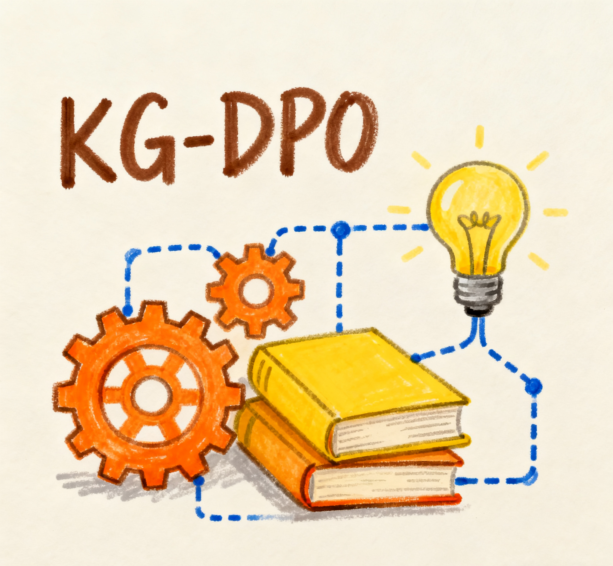
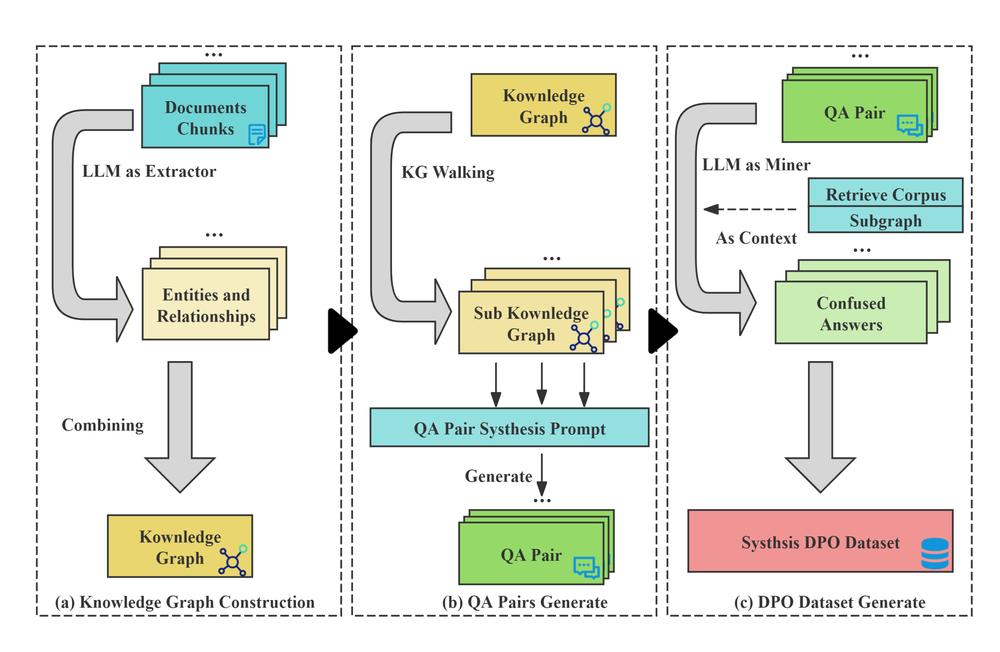
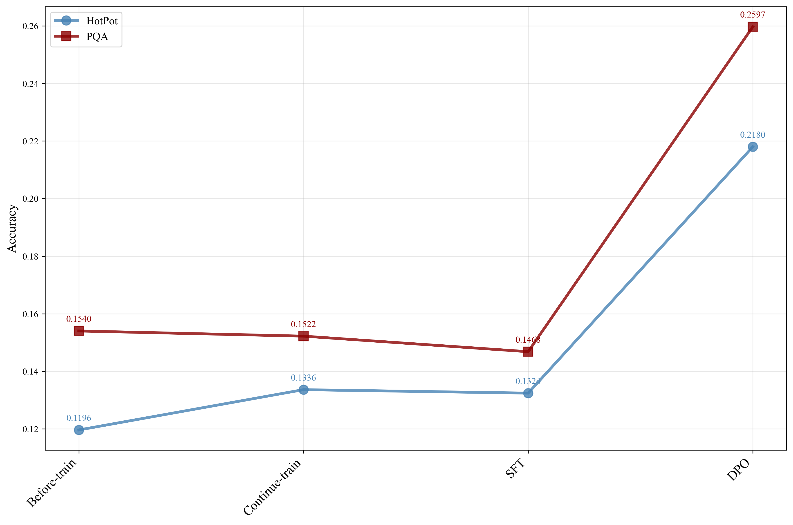

<p align="center">
  
</p>


<!-- icon -->

<!-- [](https://github.com/open-sciencelab/KG-DPO)
[](https://github.com/open-sciencelab/KG-DPO)
[](https://github.com/open-sciencelab/KG-DPO/issues)
[](https://github.com/open-sciencelab/KG-DPO/issues)
[](https://kg-dpo-cookbook.readthedocs.io/en/latest/)
[](https://cdn.vansin.top/internlm/dou.jpg)
[](https://arxiv.org/abs/2505.20416)
[](https://huggingface.co/papers/2505.20416) -->
KG-DPO: 基于知识图谱的直接偏好优化数据合成框架

<details open>
<summary><b>📚 目录</b></summary>

- 📝 [什么是KG-DPO？](#-什么是kg-dpo)
- 🚀 [快速开始](#-快速开始)
- 📌 [最新更新](#-最新更新)
- 🏗️ [方法与结果](#-方法与结果)
- 🍀 [致谢](#-致谢)
- 📚 [引用](#-引用)
- 📜 [许可证](#-许可证)

</details>

## 📝 什么是KG-DPO？

在这项工作中，我们提出并验证了一种新颖的基于知识图谱的DPO数据合成方法，称为KG-DPO，该方法利用负例挖掘（NE-Mining）构建高质量的DPO训练数据集。该框架结合了知识图谱的结构化关系知识优势和直接偏好优化（DPO）在偏好学习中的优势。具体来说，它首先利用知识图谱生成富含深度逻辑结构和实体关系的问答对，然后通过负例挖掘创建事实冲突但风格一致的反例，形成用于DPO训练的偏好数据对。本研究为将LLMs应用于知识密集型领域提供了一个经过验证的有效范式。

## 🚀 快速开始

### 环境设置

```bash
# 创建conda环境
conda create -n kg_dpo python=3.10
conda activate kg_dpo

# 安装依赖
pip install -r requirements.txt
```

### 数据生成

```bash
# 生成KG-DPO数据
bash scipt/run-kg-dpo.sh
```

### 数据格式转换

```bash
# 转换为ChatML格式
bash scipt/chatml-convert.sh
```

### 知识图谱可视化

```bash
# 可视化知识图谱
bash scipt/kg-visual.sh
```

### 评估

```bash
# 在基准测试上运行评估
bash scipt/run-eval.sh
```

### 训练

```bash
# DPO训练示例
bash scipt/example-train-dpo.sh

# SFT训练示例  
bash scipt/example-train-sft.sh

# CPT训练示例
bash scipt/example-train-cpt.sh
```

## 📌 最新更新

- **2025.09.18**: KG-DPO框架初始版本发布

## 🏗️ 方法与结果

### 关键方法创新
<p align="center">
  
</p>

1. **KG-DPO 框架：**: 首次将知识图谱驱动的数据合成与基于负例挖掘（NE-mined）的 DPO 训练进行系统性整合。该框架借助知识图谱生成富含深度逻辑推理与实体关系的高质量训练数据，并构建偏好对（正例 vs 负例）用于 DPO 训练。
2. **实证验证**: 在一系列知识密集型任务上开展大量实验，验证了 KG-DPO 的有效性。结果显示，该框架显著优于持续预训练、基于语料库的 SFT（Corpus-SFT）、基于知识图谱的 SFT（KG-SFT）、基于语料库的 DPO（Corpus-DPO）等多个基线模型。
3. **机制分析**: 在验证整体有效性之外，对框架底层机制展开深入分析。研究表明，相比基于语料库的合成方式，基于知识图谱的合成数据知识密度更高、逻辑一致性更强；同时，DPO 训练通过利用负例，可有效降低伪模式学习风险，最终突破 SFT 的局限性。

### 实验结果
#### 方法比较
<p align="center">
  
</p>


#### 实验结果
<table><thead><tr><th rowspan="2"><p>Model Type</p></th><th rowspan="2"><p>Method Group</p></th><th rowspan="2"><p>Method Name</p></th><th colspan="2"><p>HotpotEvel</p></th><th colspan="2"><p>PQArefEvel</p></th></tr><tr><th><p>Acc</p></th><th><p>Std</p></th><th><p>Acc</p></th><th><p>Std</p></th></tr></thead><tbody><tr><td rowspan="5"><p>Qwen2.5-1.5B-Base</p></td><td rowspan="3"><p>Non-DPO</p></td><td><p>GraphGen (KG-SFT)</p></td><td><p>0.1324</p></td><td><p>0.0029</p></td><td><p>0.1468</p></td><td><p>0.0029</p></td></tr><tr><td><p>Entigraph (KG-SFT)</p></td><td><p>0.1452</p></td><td><p>0.0050</p></td><td><p>0.1515</p></td><td><p>0.0081</p></td></tr><tr><td><p>Corpus-QAGen (Corpus-SFT)</p></td><td><p>0.1410</p></td><td><p>0.0038</p></td><td><p>0.1345</p></td><td><p>0.0032</p></td></tr><tr><td rowspan="2"><p>DPO-Enhanced</p></td><td><p>Corpus-QAGen (Corpus-DPO)</p></td><td><p>0.2075</p></td><td><p>0.0021</p></td><td><p>0.2388</p></td><td><p>0.0039</p></td></tr><tr><td><p>GraphGen (KG-DPO)</p></td><td><p><strong>0.2180</strong></p></td><td><p><strong>0.0020</strong></p></td><td><p><strong>0.2597</strong></p></td><td><p><strong>0.0027</strong></p></td></tr><tr><td rowspan="5"><p>Qwen2.5-1.5B-Instruct</p></td><td rowspan="3"><p>Non-DPO</p></td><td><p>GraphGen (KG-SFT)</p></td><td><p>0.1721</p></td><td><p>0.0026</p></td><td><p>0.1630</p></td><td><p>0.0047</p></td></tr><tr><td><p>Entigraph (KG-SFT)</p></td><td><p>0.1703</p></td><td><p>0.0026</p></td><td><p>0.1572</p></td><td><p>0.0034</p></td></tr><tr><td><p>Corpus-QAGen (Corpus-SFT)</p></td><td><p>0.1603</p></td><td><p>0.0038</p></td><td><p>0.1649</p></td><td><p>0.0029</p></td></tr><tr><td rowspan="2"><p>DPO-Enhanced</p></td><td><p>Corpus-QAGen (Corpus-DPO)</p></td><td><p>0.2292</p></td><td><p>0.0022</p></td><td><p>0.4155</p></td><td><p>0.0024</p></td></tr><tr><td><p>GraphGen (KG-DPO)</p></td><td><p><strong>0.2383</strong></p></td><td><p><strong>0.0015</strong></p></td><td><p><strong>0.4573</strong></p></td><td><p><strong>0.0019</strong></p></td></tr></tbody></table>

## 🍀 致谢

本项目基于并扩展了几个优秀的开源框架：

- **[GraphGen](https://github.com/open-sciencelab/GraphGen)**: 知识图谱引导的合成数据生成框架
- **[Swift](https://github.com/modelscope/swift)**: 高效的模型训练和推理框架
- **[SiliconFlow](https://siliconflow.cn)**: 丰富的LLM API，部分模型免费
- **[LightRAG](https://github.com/HKUDS/LightRAG)**: 简单高效的图检索解决方案
- **[ROGRAG](https://github.com/tpoisonooo/ROGRAG)**: 稳健优化的GraphRAG框架
- **[DB-GPT](https://github.com/eosphoros-ai/DB-GPT)**: AI原生数据应用开发框架

我们衷心感谢这些项目及其贡献者的基础性工作。

## 📚 引用

如果您在研究中使用了KG-DPO，请引用我们的工作：

<!-- ```bibtex
@misc{chen2025kgdpoenhancingllmswithknowledgegraphs,
      title={KG-DPO: Enhancing LLMs with Knowledge Graphs and Direct Preference Optimization}, 
      author={Zihong Chen and Wanli Jiang and Jinzhe Li and Zhonghang Yuan and Huanjun Kong and Wanli Ouyang and Nanqing Dong},
      year={2025},
      eprint={2505.20416},
      archivePrefix={arXiv},
      primaryClass={cs.CL},
      url={https://arxiv.org/abs/2505.20416}, 
}
``` -->

## 📜 许可证

本项目采用 [Apache License 2.0](LICENSE) 许可证。